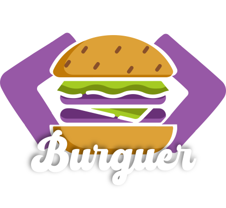

  

Tecnologias utilizadas:
 Frontend

  
  
  
  
  

 Backend

  
  
  
  
  

 
 
Um projeto robusto que trás um pouco da pratica no mercado de trabalho.

O DevBurger é uma plataforma que oferece uma interface completa para os clientes com autenticação e gerenciamento de clientes e administradores, para que cada usuário tenha acesso adequado, além de possibilitar um acompanhamento para o administrador do negocio com funções de editar e adicionar novos produtos e acompanhar todos os pedidos.

Frontend: React.js com Styled Components.

Backend: Node.js com os bancos Mongodb e Postgres.

💳 Pagamentos: Integração com o Stripe, dando uma experiência da pratica feita pelo mercado profissional.

Vídeo do projeto
<video href="" target="_blank">Clique aqui</video> para acessar a postagem

Repositório do Back-end
<a href="https://github.com/rodolfossilvadev/devburgerapi" target="_blank">Clique aqui</a> para acessar o repositório
